# Milestone Project One /  Me And The Moon

[View the live project here](https://matthewelstone.github.io/MeAndTheMoon/index.html)

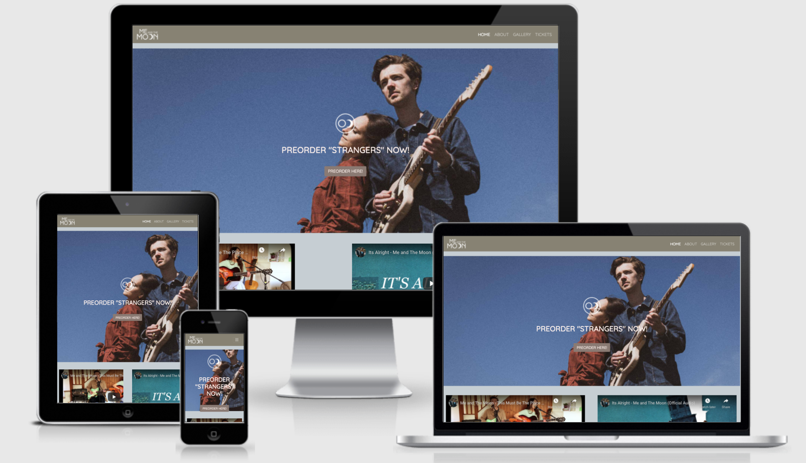

This website has been created for my milestone one User Centric Development Project.
I want to create a website for fans and potential fans of my brothers band Me and the Moon. I want it to be responsive, intuative to use and a great user experiance. 

## Contents

- User Expreience

  - User Stories
  - Owner Goals
  - Design

- Features
   
  - Current Features
  - Features which I want to implement in the future

- Technologies Used

- Testing
  - Testing User Stories and Site Goals
  - Lighthouse Testing
  - HTML and CSS Testing
  - Known Bugs

- Deployment

- Credits

## User Experience 

### User Stories

- **First Time Visitor Goals**
  1. As a first time visitor, I want to easily understand main purpose of the site.
  2. As a first time visitor, I want to be able to easily navigate through the site and find the content I need.
  3. As a first time visitor, I want the site to be visually apealing.
  4. As a first time visitor, I expect the site to be responsive so that I can view it on any device type. 
  5. As a first time visitor, I want to be able to tell who the band are and decide if i might like them. 

- **Returning Visitor Goals**
  1. As a returning visitor, I want to be able to see the latest music or video content that the band has released.
  2. As a returning visitor, I want to be able to see where and when the band are playing so that I can book tickets.
  3. As a returning visitor, I would like to find out more information about the members and history of the band. 
  4. As a returning visitor, I would like to see any social media accounts the band has so that I can follow them there. 
  5. As a returning visitor, I would like to see any pictures of the of the band. 
- **Frequent Visitor Goals.**
  1. As a frequent visitor, I want to see the latest music or video content that the band has released. 
  2. As a frequent visitor, I would like to be kept up to date with any news about the band.
  3. As a frequent visitor, I would like to be able to contact the band for any gigs or events.

### Owner Goals
- 
  1. I want the site to clearly promote the band.
  2. I want users to easily find links to social media accounts.
  3. I want the user to easily be able to find when and where they can see the band live.
  4. I want to promote the latest videos of the band. 
  5. I want the site to be responsive and easy to navigate. 
  6. I want the site to be attractive.
  7. I want users to easily be able to contact the band. 

  ### Design

I wanted the design of the website to fit in with many of the bands existing promotional material.Using colors and fonts to compliment them. I wanted each page to be easy to navigate and to work semelessly with each other using the same colour combinations but in slightly different formats. 

- ### Colour scheme

  - I Picked the colour scheme by using a digital colour meter on the background of the Main image of the Index page.  I then entered that colour (#c6ced3) into the Adobe color wheel on the split complimentary setting. 

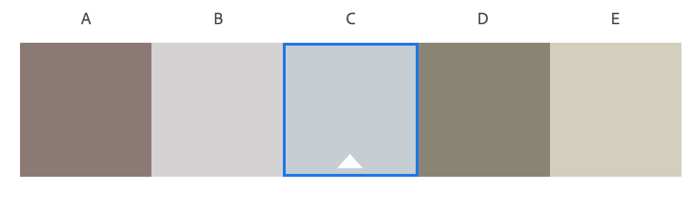

- ### Typography
  - I only used one font throughout the website which is Quicksand from Google Fonts with a backup font of sans-serif if for some reason Quicksand doesnt load. I chose quicksand for the site because it is a complimentary font to the bands logos font with it looking quite similar but is easier to read in larger blocks of text. 

- ### Imigary
  - All of the images that I used were sent to be by the band and were used to enhance the visual aspect of the page. 

- ### Wireframes

I made all of my wireframes using Balsamiq. Making one for each page showing how the page would change for each screen size. 

  - Index
[Mobile](https://github.com/matthewelstone/MeAndTheMoon/blob/master/assets/readmeimages/index-mobile.png) [Tablet](https://github.com/matthewelstone/MeAndTheMoon/blob/master/assets/readmeimages/index-tablet.png) [Web](https://github.com/matthewelstone/MeAndTheMoon/blob/master/assets/readmeimages/index-web.png)
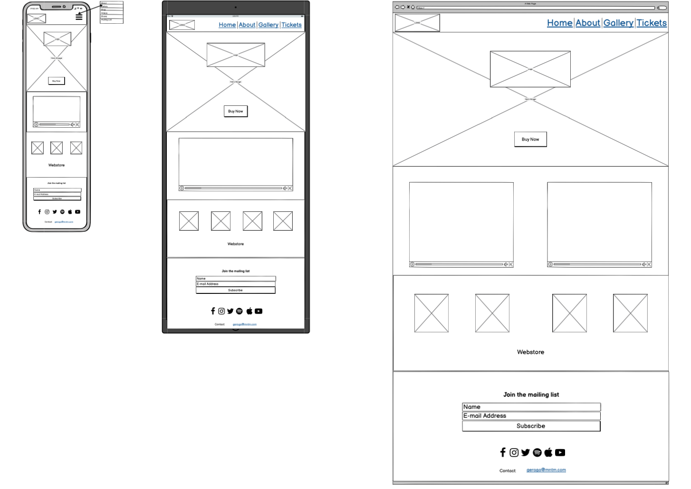

- About
[Mobile](https://github.com/matthewelstone/MeAndTheMoon/blob/master/assets/readmeimages/about-mobile.png) [Tablet](https://github.com/matthewelstone/MeAndTheMoon/blob/master/assets/readmeimages/about-tablet.png) [Web](https://github.com/matthewelstone/MeAndTheMoon/blob/master/assets/readmeimages/about-web.png)
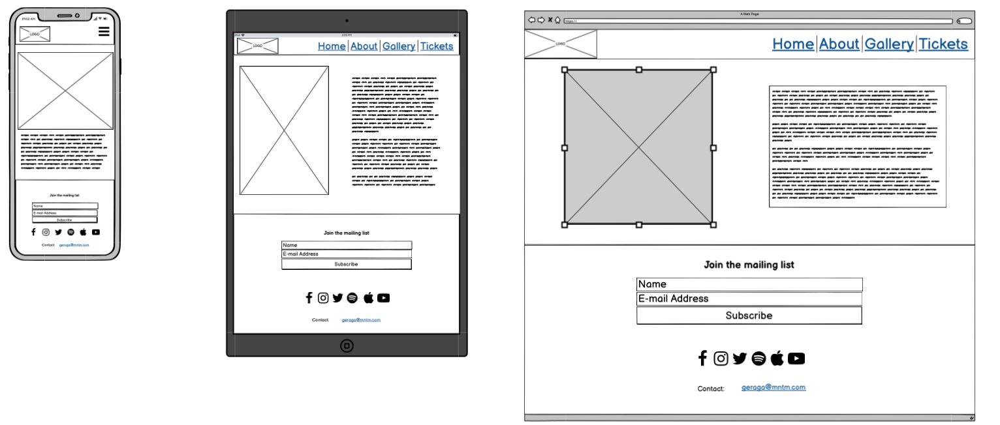

- Gallery
[Mobile](https://github.com/matthewelstone/MeAndTheMoon/blob/master/assets/readmeimages/gallery-mobile.png) [Tablet](https://github.com/matthewelstone/MeAndTheMoon/blob/master/assets/readmeimages/gallery-tablet.png) [Web](https://github.com/matthewelstone/MeAndTheMoon/blob/master/assets/readmeimages/gallery-web.png)
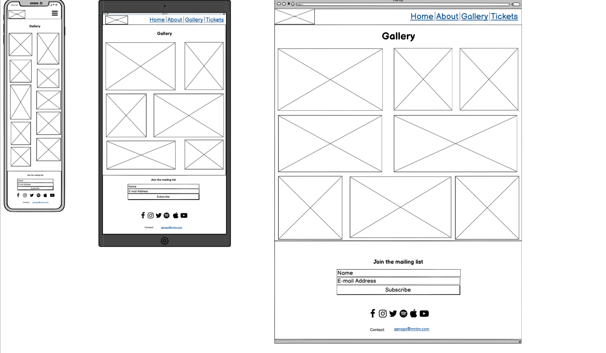

- Tickets
[Mobile](https://github.com/matthewelstone/MeAndTheMoon/blob/master/assets/readmeimages/tickets-mobile.png) [Tablet](https://github.com/matthewelstone/MeAndTheMoon/blob/master/assets/readmeimages/tickets-tablet.png) [Web](https://github.com/matthewelstone/MeAndTheMoon/blob/master/assets/readmeimages/tickets-web.png)
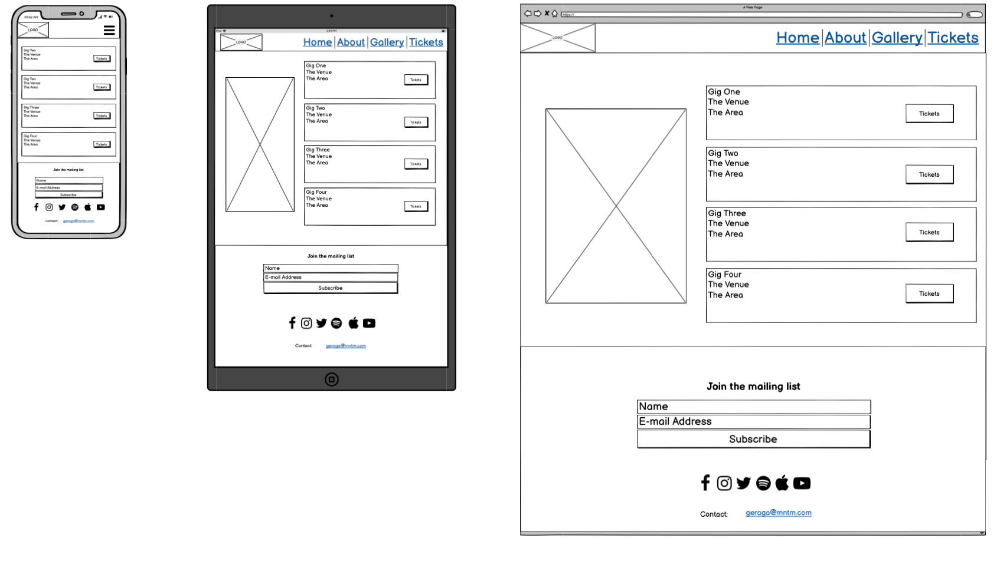

For the most part I kept the design of the website very similar to the wireframes only makeing a few changes.  Changing how many of the images for the shop you are able to see at the different breakpoints and also changing how many of the videos you can see at the different breakpoints. 

## Features
### Current Features
- Responsive on all device sizes.
- Accessable. 
- Social links for the band.
- Ticket links for the band.
- Embedded code from YouTube linking you to the bands videos.
- Contact information for the band when clicked will open up an email. 
- Links sending you to the bands webshop. 
### Features which i want to implement in the future
- A webshop built into the website instead of sending you to another site.
- Interactive maps so that you can see more clearly where the band are playing.
- Fans being able to send in their own pictures of the band which can then be added to the gallery.
- Being able to book tickets directly from the site rather than the site sending you to ticketmaster.

### Technologies Used
## Languages Used
1. [HTML5](https://en.wikipedia.org/wiki/HTML5)
2. [CSS3](https://en.wikipedia.org/wiki/CSS)

## Frameworks, Libraries, Programs Used
1. [Bootstrap v4.6.0](https://getbootstrap.com/)
Bootstrap was used for the responsive layout of the site before styling it.
2. [Google Fonts](https://fonts.google.com/)
Google fonts was used throughout the site to import the Quicksand font.
3. [Git](https://git-scm.com/)
Git was used as a version control software.
4. [GitHub](https://github.com/)
Github was used as a remote repository where I pushed changes to and also to deploy the site with github pages.
5. [GitPod](https://www.gitpod.io/)
Gitpod was the text editor that I used to write the HTML and CSS in up untill its latest update. When it updated I found that the changes I made to the code took too long to apply to the site.
6. [Visual Studio Code](https://code.visualstudio.com/)
Visual Studio Code was the text editor that I used to write the rest of the HTML and CSS.
7. [Font Awesome](https://fontawesome.com/)
Font awesome was used for the social media icons and burger icon on the site.
8. [Balsamiq](https://balsamiq.com/)
Balsamiq was used to make the wireframes
9. [TinyPNG](https://tinypng.com/)
TinyPNG was used to compress the images down to a smaller size so that the webpages could load much faster.
10. [Chrome Devtools](https://developer.chrome.com/docs/devtools/)
Chrome Devtools helped me to style thge site, fix any bugs that I found and test the performance of the site through lighthouse.
11. [Am I Responsive](http://ami.responsivedesign.is/)
Am I Responsive was used for the Image at the top of the readme.

## Testing 

### Testing User Stories and Site Goals

### First Time Visitor Goals

**As a first time visitor, I want to easily understand main purpose of the site.** 

- As you enter the site on the Jumbotron there is a clear image of the band.  you can tell that they are a band as one of them is holding a guitar and overlaying this there is a preorder now button. 

**As a first time visitor, I want to be able to easily navigate through the site and find the content I need.**

- There is a nav menu at the top of all pages making it easy to navigete.  The bands logo in the top left corner will also link you back to the homepage.

**As a first time visitor, I want the site to be visually apealing.**

- I have asked friends family and members on slack about the site and overall the response to the site was very good. With a consistent colour scheme and high quality pictures too.

**As a first time visitor, I expect the site to be responsive so that I can view it on any device type.**

- I have tested the site on multiple devices and everything responds well.  I have also sent the site to friends and family asking them to find any thing.

**As a first time visitor, I want to be able to tell who the band are and decide if i might like them.**

- There is an about section to the site which tells you more about the band and also embededvideos to listen to the music to help decide if you might like the band.

### Returning Visitor Goals

**As a returning visitor, I want to be able to see the latest music or video content that the band has released.**

- You can see the latest videos on the home screen where they are also promoting the latest EP that is comig out.

**As a returning visitor, I want to be able to see where and when the band are playing so that I can book tickets.**

- There is a tickets page where you can see all the latest shows and will be sent to where you can buy them from.

**As a returning visitor, I would like to find out more information about the members and history of the band.**

- There is an about section on the band where you can find out more information about the band.

**As a returning visitor, I would like to see any social media accounts the band has so that I can follow them there.**

- In the footer there are social media links which will send you through to all of their various social media accounts. These will all open up in new tabs.

**As a returning visitor, I would like to see any pictures of the of the band.**

- there is a gallery page where you can see more pictures of the band.

### Frequent Visitor Goals.

**As a frequent visitor, I want to see the latest music or video content that the band has released.**

- You can see the latest videos on the home screen where they are also promoting the latest EP that is comig out.

**As a frequent visitor, I would like to be kept up to date with any news about the band.**

- There is a mailing list subscription button at the bottom of each page where you can sign up for the latest news.

**As a frequent visitor, I would like to be able to contact the band for any gigs or events.**

- There is an email address at the bottom of the page.  When clicked the it will open up a new blank email with a subject of contact.
### Owner Goals

**I want the site to clearly promote the band.**

- The site clearly promotes who the band is with their logo being at the top of each page.

**I want users to easily find links to social media accounts.**

- In the footer there are social media links which will send you through to all of their various social media accounts. These will all open up in new tabs.

**I want the user to easily be able to find when and where they can see the band live.**

- There is the tickets page. there they can see the next events that the band will be playing at and where the closest one to them will be. 

**I want to promote the latest videos of the band.**

- The first thing that the user will see after the hero image will be videos of the band. 

**I want the site to be responsive and easy to navigate.**

The site is easily navigated by the nav bar at the top of each page.  The site is responsive across all device types by using bootstrap.

**I want the site to be attractive.**

- I have asked friends family and members on slack about the site and overall the response to the site was very good. With a consistent colour scheme and high quality pictures too.

**I want users to easily be able to contact the band.**

- There is an email address at the bottom of the page.  When clicked the it will open up a new blank email with a subject of contact.

### Lighthouse Testing

Lighthouse testing seemed to vary quite a lot depending on the time of day. I think this may be to do with the internet conection that I have isn't the most reliable and can change drastically. On most of the pages I got quite good performance scores.

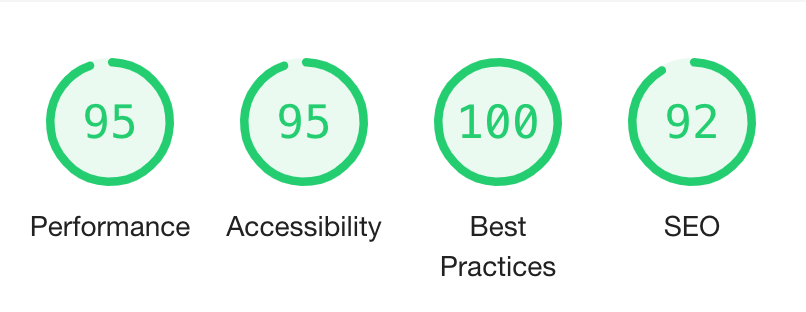

However Some of the images that I am using are too big.  I have tried to reduce the size of these images and they arent getting any smaller.  These were huge pictures which I recieved from the band but right now I dont think I have the knowledge to make them smaller and improve the score.  

### HTML and CSS Testing

- HTML and CSS 
To test my HTML I used the [W3C Markup Validation Service](https://validator.w3.org/)
Mostly my HTML was okay and it only came up with a few problems.  I had buttons on two of the pages which were siblings of anchor tags. I fixed these by giving the anchor tags classes which were the same as the buttons and deleating the buttons.
The YouTube links that I have embedded in the index.html page also failed as they had inline styling. I fixed this by giving them a class and styling them there. 
The last thing was my form.  Emmet had given it an empty action attribute and as the form will not actually be posting anywhere I got rid of that. 

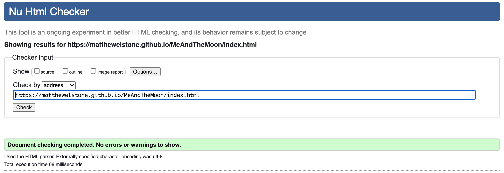
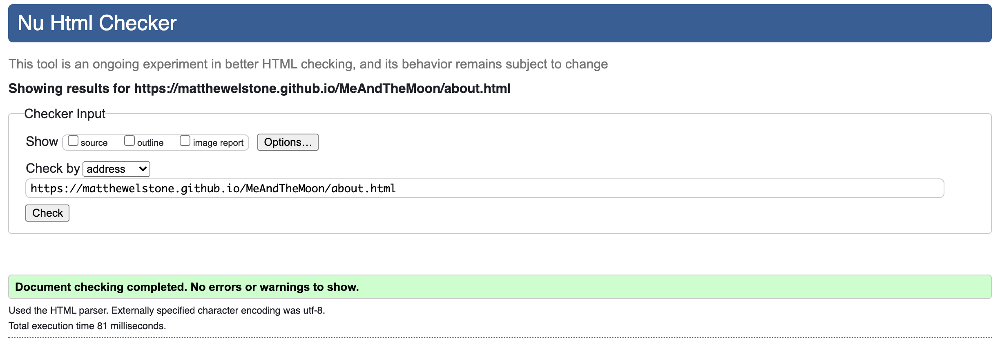

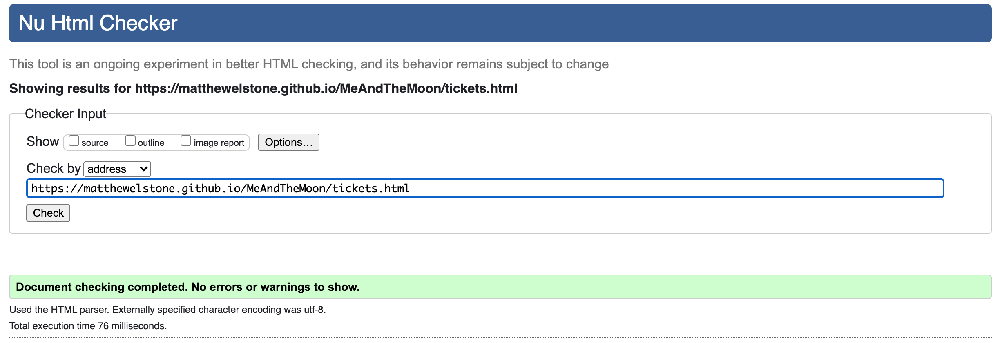

To test my CSS I used the [W3C CSS Validator](https://jigsaw.w3.org/css-validator/validator)
My CSS was also mostly fine. I only needed to get rid of a couple of lines of code which weren't correct. 
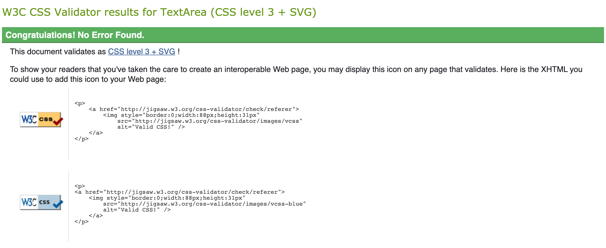

### Known Bugs

- There is a slight overflow problem on the index page where there is about 15px of empty space on the right.  I believe that this is caused by the div containig the second embedded youtube video. 
I have tried applying overflow:hidden to several different elements but it hasn't worked. 

- There is the lighthouse performance which I mentioned above.  The pictures that I am using are too big and the file size needs to be much smaller.  

### Deployment

- Creation

I first created this repository by doing the following.

1. Logging into GitHub and clicking the green New button in the top right corner of the screen. 
2. I then created a new repository using the Code-Institute-Org/gitpod-full-template and used the repository name MeAndTheMoon I then clicked create repository. 
3. I already had downloaded the Gitpod chrome plugin so then clicked the green Gitpod button on the repository where i could start writing the code for the site. 

### Github Pages

I deployed the site by using GitHub Pages by doing the following.

1. Logging into Github and apening the MeAndTheMoon Repository. 
2. Opening settings on the right hand side of the screen. 
3. Scrolling all the way down to the gitHub Pages section.
4. Choosing the Master branch and Root folder.
5. After a few minutes my site was published at https://matthewelstone.github.io/MeAndTheMoon/

### Forking the Repository

to fork the repository to contribute to the project you can do the following.
1. Log in to GitHub and open the MeAndTheMoon repository. 
2. At the top right of the page underneath your profile there is a fork symbol. 
3. Once you have clicked that the repository will be forked.

### Cloning the Repository

If you want to clone the repository you can do the following. 
1. Go to [my account](https://github.com/matthewelstone)and sellect the MeAndTheMoon Repository
2. Next door to the Gitpod button (if you have git pod installed) or in the top right click the Code button.
3. Click download zip.
4. You can then open the repository with your chosen code editor.

### Credits

- [Bootstrap](https://getbootstrap.com/) was used throughout the site to help style the pages and to make the site responsive.
- [YouTube](https://www.youtube.com/) code was used from YouTubeto embed videos on the site.
-[Harvey Gorst](https://harveygorst.com/), [Sophia Carey](https://www.sophiacarey.co.uk/),[Context Films](https://www.contextfilms.co/), Jonathan Elstone and Tamara Grzegorzek Were the photographers who took all of the pictures for the site.

### Achnowledgements
- Code Institute.
- My mentor Akshat Garg.
- W3 Schools for various articles.
- Mini Feb team 2021 For help with feedback through the last few months.
